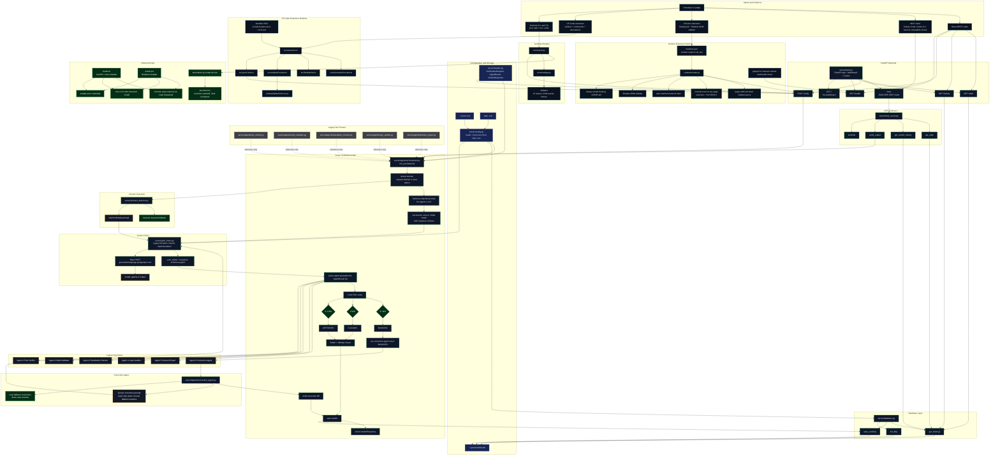

```mermaid
flowchart TB

classDef surface fill:#0b1220,stroke:#38bdf8,color:#e2e8f0,stroke-width:1px;
classDef backend fill:#0f172a,stroke:#22c55e,color:#e2e8f0,stroke-width:1px;
classDef agent fill:#111827,stroke:#f59e0b,color:#f8fafc,stroke-width:1px;
classDef data fill:#172554,stroke:#a78bfa,color:#e2e8f0,stroke-width:1px;
classDef runtime fill:#052e16,stroke:#4ade80,color:#f0fdf4,stroke-width:1px;
classDef legacy fill:#3f3f46,stroke:#a1a1aa,color:#f8fafc,stroke-width:1px;

subgraph Users["Inputs and Surfaces"]
  U0["Developer or judge"]:::surface
  T0["Terminal CLI and TUI<br/>juror start / run / verify"]:::surface
  V0["VS Code extension<br/>sidebar + commands + decorations"]:::surface
  C0["Chrome extension<br/>floating pill + Shadow DOM sidebar"]:::surface
  M0["MCP client<br/>Claude Code, Codex CLI, Gemini-compatible clients"]:::surface
  A0["Direct REST caller"]:::surface
end

subgraph Backend["FastAPI Backend"]
  B0["server/main.py<br/>FastAPI app + dashboard + routes"]:::backend
  B1["GET /<br/>live dashboard"]:::backend
  B2["GET /health"]:::backend
  B3["POST /verify"]:::backend
  B4["GET /history"]:::backend
  B5["GET /stats"]:::backend
  B6["/mcp<br/>JSON-RPC MCP router"]:::backend
end

subgraph Config["Configuration and Storage"]
  C1["server/config.py<br/>loads ~/.juror/.env then repo .env"]:::data
  C2["server/models.py<br/>VerificationRequest, AgentResult, VerdictResponse"]:::data
  C3["~/.juror/verdicts.db"]:::data
  C4["~/.juror/.env"]:::data
  C5["repo .env"]:::data
end

subgraph Core["Active Verification Path"]
  O0["server/agents/orchestrator.py<br/>run_jury(request)"]:::backend
  O1["detect domain<br/>request.domain or auto-detect"]:::backend
  O2["build one batched prompt<br/>for Agents 1 to 5"]:::backend
  O3["call Gemini once in JSON mode<br/>with response schema"]:::backend
  O4["parse agent payloads into AgentResult list"]:::backend
  O5["count FAIL votes"]:::backend
  D0{"0-1 fails"}:::runtime
  D1{"2 fails"}:::runtime
  D2{"3+ fails"}:::runtime
  O6["APPROVED"]:::backend
  O7["FLAGGED"]:::backend
  O8["BLOCKED"]:::backend
  O9["flatten + dedupe issues"]:::backend
  O10["run correction agent only if BLOCKED"]:::backend
  O11["build correction diff"]:::backend
  O12["save verdict"]:::backend
  O13["return VerdictResponse"]:::backend
end

subgraph Domain["Domain Detection"]
  D10["server/domain_detector.py"]:::backend
  D11["Gemini domain prompt"]:::agent
  D12["heuristic keyword fallback"]:::runtime
end

subgraph Gemini["Gemini Client"]
  G0["server/grok_client.py<br/>legacy filename, Gemini implementation"]:::backend
  G1["httpx POST<br/>generativelanguage.googleapis.com"]:::backend
  G2["model: gemini-2.5-flash"]:::agent
  G3["json_mode + response schema support"]:::backend
end

subgraph Jury["Logical Jury Roles"]
  J1["Agent 1 Fact Verifier"]:::agent
  J2["Agent 2 Math Validator"]:::agent
  J3["Agent 3 Standards Checker"]:::agent
  J4["Agent 4 Logic Auditor"]:::agent
  J5["Agent 5 Domain Expert"]:::agent
  J6["Agent 6 Correction Agent"]:::agent
end

subgraph Correction["Correction Agent"]
  R0["server/agents/correction_agent.py"]:::backend
  R1["local fallback corrections<br/>demo-safe rewrites"]:::runtime
  R2["Gemini correction prompt<br/>used only when no local fallback matches"]:::agent
end

subgraph Persistence["Database Layer"]
  P0["server/database.py"]:::backend
  P1["init_db()"]:::backend
  P2["save_verdict()"]:::backend
  P3["get_history()"]:::backend
end

subgraph MCP["MCP Exposure"]
  M1["server/mcp_server.py"]:::backend
  M2["tools/list"]:::backend
  M3["verify_output"]:::backend
  M4["get_verdict_history"]:::backend
  M5["get_stats"]:::backend
end

subgraph Chrome["Chrome Extension Runtime"]
  CH0["manifest.json<br/>content script on all_urls"]:::surface
  CH1["content/content.js"]:::surface
  CH2["always-visible floating JUROR pill"]:::surface
  CH3["Shadow DOM sidebar"]:::surface
  CH4["auto-monitor known AI sites"]:::surface
  CH5["manual scan on any page<br/>selection + Ctrl+Shift+J"]:::surface
  CH6["page shifts left when sidebar opens"]:::surface
  CH7["popup/ for manual controls and health check"]:::surface
end

subgraph VSCode["VS Code Extension Runtime"]
  VS0["src/extension.ts"]:::surface
  VS1["src/jurorClient.ts"]:::surface
  VS2["src/sidebarProvider.ts"]:::surface
  VS3["src/fileWatcher.ts"]:::surface
  VS4["src/decorationProvider.ts"]:::surface
  VS5["media/sidebar.html css js"]:::surface
  VS6["bundled VSIX<br/>ai-hallucination-juror-1.0.0.vsix"]:::surface
end

subgraph Terminal["Terminal Runtime"]
  TT0["terminal/cli.py"]:::surface
  TT1["terminal/app.py"]:::surface
  TT2["widgets/<br/>AI output, verdict panel, history"]:::surface
end

subgraph Install["Install and Ops"]
  I0["install.sh<br/>macOS / Linux installer"]:::runtime
  I1["install.ps1<br/>Windows installer"]:::runtime
  I2["installs juror command"]:::runtime
  I3["tries VS Code extension install"]:::runtime
  I4["Chrome stays manual via Load Unpacked"]:::runtime
  I5["terminal/cli.py install-service"]:::runtime
  I6["persistence/<br/>launchd, systemd, Task Scheduler"]:::runtime
end

subgraph Legacy["Legacy but Present"]
  L0["server/agents/fact_verifier.py"]:::legacy
  L1["server/agents/math_validator.py"]:::legacy
  L2["server/agents/standards_checker.py"]:::legacy
  L3["server/agents/logic_auditor.py"]:::legacy
  L4["server/agents/domain_expert.py"]:::legacy
end

U0 --> T0
U0 --> V0
U0 --> C0
U0 --> M0
U0 --> A0

T0 --> TT0 --> B3
TT0 --> TT1 --> TT2
V0 --> VS0 --> VS1 --> B3
VS0 --> VS2 --> VS5
VS0 --> VS3
VS0 --> VS4
VS6 --> VS0
C0 --> CH0 --> CH1
CH1 --> CH2
CH1 --> CH3
CH1 --> CH4
CH1 --> CH5
CH1 --> CH6
CH7 --> B2
CH1 --> B3
M0 --> B6
A0 --> B2
A0 --> B3
A0 --> B4
A0 --> B5

B0 --> B1
B0 --> B2
B0 --> B3
B0 --> B4
B0 --> B5
B0 --> B6
B3 --> O0
B4 --> P3
B5 --> P3
B6 --> M1

C4 --> C1
C5 --> C1
C1 --> G0
C1 --> P0
C1 --> O0
C2 --> B3
C2 --> O0
P0 --> P1 --> C3
P0 --> P2 --> C3
P0 --> P3 --> C3

O0 --> O1 --> D10
D10 --> D11 --> G0
D10 --> D12
O1 --> O2 --> O3
O3 --> G0 --> G1 --> G2
G0 --> G3 --> O4
O4 --> J1
O4 --> J2
O4 --> J3
O4 --> J4
O4 --> J5
O4 --> O5
O5 --> D0
O5 --> D1
O5 --> D2
D0 --> O6 --> O9
D1 --> O7 --> O9
D2 --> O8 --> O10
O10 --> J6
J6 --> R0
R0 --> R1
R0 --> R2 --> G0
R0 --> O11
O9 --> O12 --> P2
O11 --> O12
O12 --> O13

M1 --> M2
M1 --> M3 --> O0
M1 --> M4 --> P3
M1 --> M5 --> P3

I0 --> I2
I0 --> I3
I0 --> I4
I1 --> I2
I1 --> I3
I1 --> I4
TT0 --> I5 --> I6

L0 -. reference only .-> O0
L1 -. reference only .-> O0
L2 -. reference only .-> O0
L3 -. reference only .-> O0
L4 -. reference only .-> O0
```
